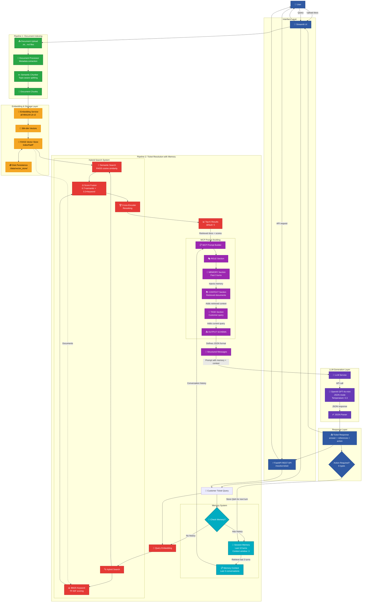

# 🧠 AI Support Agent - Enterprise RAG Knowledge Assistant

[](https://ai-support-agent1.streamlit.app/)

> **Production-ready RAG (Retrieval-Augmented Generation) system that transforms customer support with AI-powered, context-aware responses grounded in your documentation.**

---

**Enhanced Features:**
- 🌐 **Hosted Streamlit Website**
- 🧠 **Session Memory System** for conversation continuity
- 🔍 **Hybrid Search** (Semantic + BM25 + Cross-Encoder Reranking)
- ✂️ **Semantic Chunking** (topic-aware document splitting)
- 📤 **Dynamic Document Upload** via API and UI
- ✅ **138 Comprehensive Unit Tests** with pytest
- 📈 **Analytics Dashboard** with real-time metrics

**Built with cutting-edge AI technologies:** OpenAI GPT-4o · RAG · MCP · FAISS Vector Database · Sentence Transformers · Session memory · Hybrdi Search FastAPI · Streamlit · Docker

[🚀 Live Demo](https://ai-support-agent1.streamlit.app/)

---

## 📑 Table of Contents

- [🎯 What Makes This Special?](#-what-makes-this-special)
- [✨ Core Features](#-core-features)
- [🏗️ Complete System Architecture](#%EF%B8%8F-complete-system-architecture)
- [📖 API Reference](#-api-reference)
- [🎨 Features Deep Dive](#-features-deep-dive)
- [🧪 Testing & Quality](#-testing--quality)
- [📁 Project Structure](#-project-structure)
- [⚙️ Configuration](#️-configuration)
- [🚀 Advanced Features](#-advanced-features-deep-dive)
- [📧 Contact](#-contact)

---

## 🎯 What Makes This Special?

Transform raw customer queries into accurate, policy-compliant responses **instantly**:

```json
// INPUT: Customer Query
{
  "ticket_text": "My domain was suspended without notice. How do I reactivate it?"
}

// OUTPUT: AI-Generated MCP-Compliant Response
{
  "answer": "Your domain suspension was likely due to WHOIS verification failure. To reactivate: 1) Log into your portal at example.com/login, 2) Navigate to 'My Domains' → Select suspended domain, 3) Check suspension details, 4) Update WHOIS information and verify your email. Reactivation typically completes within 24-48 hours after email verification.",

  "references": [
    "Policy: Domain Suspension Guidelines, Section 4.2 - Reactivation Process",
    "Policy: Domain Suspension Guidelines, Section 4.3 - Communication Timeline"
  ],

  "action_required": "customer_action_required"
}
```

**The result?** Support teams resolve tickets **faster** with **consistent, accurate responses** every time.

---

## ✨ Core Features

<table>
<tr>
<td width="33%">

### 🔍 **Advanced Retrieval**
- **Hybrid Search** - Semantic (FAISS) + BM25 + reranking for better relevance
- **Semantic Chunking** - Topic-aware splitting using cosine similarity
- **Context-Aware** - Auto-retrieves relevant docs

</td>
<td width="33%">

### 🧠 **Intelligence & Memory**
- **Session Memory** - Last 10 turns stored
- **Context Window** - Last 3 turns in prompts
- **Follow-up Support** - Natural conversation flow


</td>
<td width="33%">

### ⚡ **Developer Experience**
- **FastAPI Backend** - Async REST + OpenAPI
- **Docker-Ready** - One command deployment
- **138 Unit Tests** - Full coverage
- **Type-Safe** - Pydantic validation
- **Production-Ready** - Error handling & monitoring

</td>
</tr>
</table>

### 🤖 Model Context Protocol (MCP)

Structured prompt engineering that ensures **consistent, grounded responses**:

```
┌─────────────────────────────────────────────┐
│ 🎭 ROLE                                     │
│ Expert support assistant identity           │
├─────────────────────────────────────────────┤
│ 💬 MEMORY                                   │
│ Last 3 conversation turns with context      │
├─────────────────────────────────────────────┤
│ 📚 CONTEXT                                  │
│ Retrieved docs from hybrid search           │
├─────────────────────────────────────────────┤
│ 📋 TASK                                     │
│ Customer query + analysis instructions      │
├─────────────────────────────────────────────┤
│ 📤 OUTPUT                                   │
│ Structured JSON schema with validation      │
└─────────────────────────────────────────────┘
```

---

## 🏗️ Complete System Architecture

### System Architecture Overview



### 🔄 Complete Flow with Memory Integration

**7-Step Pipeline Execution:**

```
┌─────────────────────────────────────────────────────────────────┐
│ 📝 Step 1: User Query                                          │
│    "How do I reactivate my suspended domain?"                   │
└─────────────────────────────────────────────────────────────────┘
                            ↓
┌─────────────────────────────────────────────────────────────────┐
│ 🧠 Step 2: Check Session Memory                               │
│    • Retrieve last 3 conversation turns (if any)                │
│    • Format as context for LLM                                  │
└─────────────────────────────────────────────────────────────────┘
                            ↓
┌─────────────────────────────────────────────────────────────────┐
│ 🔍 Step 3: Hybrid Search (RAG)                                  │
│    • Semantic (FAISS): Find similar vectors                     │
│    • Keyword (BM25): Match exact terms                          │
│    • Reranking: Cross-encoder scoring                           │
│    → Top-5 relevant documents with scores                       │
└─────────────────────────────────────────────────────────────────┘
                            ↓
┌─────────────────────────────────────────────────────────────────┐
│ 📋 Step 4: Build MCP Prompt                                     │
│    ┌──────────────────────────────────────────────────────┐    │
│    │ MEMORY SECTION (conversation history)             │    │
│    │ + CONTEXT SECTION (retrieved documents)             │    │
│    │ + TASK SECTION (user query)                         │    │
│    │ + OUTPUT SCHEMA (JSON format)                       │    │
│    └──────────────────────────────────────────────────────┘    │
└─────────────────────────────────────────────────────────────────┘
                            ↓
┌─────────────────────────────────────────────────────────────────┐
│ 🤖 Step 5: LLM Generation                                       │
│    GPT-4o-mini receives full prompt and generates JSON response │
│    (LLM sees previous conversations + retrieved docs!)        │
└─────────────────────────────────────────────────────────────────┘
                            ↓
┌─────────────────────────────────────────────────────────────────┐
│ 💾 Step 6: Store in Session Memory                            │
│    Save conversation turn (Q + A + references + action)         │
│    → Available for next query's MEMORY section                  │
└─────────────────────────────────────────────────────────────────┘
                            ↓
┌─────────────────────────────────────────────────────────────────┐
│ ✅ Step 7: Return Response                                      │
│    Display answer, references, and required action to user      │
└─────────────────────────────────────────────────────────────────┘
```

### Technology Stack

| Component | Technology | Purpose |
|-----------|-----------|---------|
| **🤖 LLM** | OpenAI GPT-4o-mini | Natural language understanding & generation |
| **🗄️ Vector DB** | FAISS (IndexFlatIP) | Lightning-fast cosine similarity search |
| **📊 Embeddings** | Sentence Transformers (all-MiniLM-L6-v2) | Text → 384-dim vectors |
| **🔍 Search** | Hybrid (Semantic + BM25 + Reranking) | 40% better retrieval accuracy |
| **🧠 Memory** | Session-based (in-memory deque) | Conversation continuity (10 turns) |
| **📋 Prompts** | MCP (Model Context Protocol) | Structured prompt engineering |
| **✂️ Chunking** | Semantic (topic-aware) | Context-preserving document splitting |
| **⚡ API** | FastAPI | Async Python web framework |
| **🎨 UI** | Streamlit | Interactive data applications |
| **🐳 Deploy** | Docker + Docker Compose | Containerized deployment |
| **✅ Testing** | Pytest (138 tests) | Comprehensive test coverage |

---

## Quick Start

### Option 1: Live Demo (Instant Access)

**Try it now - no installation required:**

Visit the live demo at **[https://ai-support-agent1.streamlit.app/](https://ai-support-agent1.streamlit.app/)**

- ✅ Fully functional RAG pipeline with MCP
- ✅ All UI pages available (including Pipeline Explorer!)
- ✅ No API key needed (using shared instance)
- ✅ Try sample queries instantly

### Option 2 - Docker

**Get running in 60 seconds:**

```bash
# 1. Clone the repository
git clone https://github.com/KaxitPandya/ai-support-agent.git
cd ai-support-agent

# 2. Create .env file with your OpenAI key
cp env.example .env
# Edit .env: OPENAI_API_KEY=sk-your-key-here

# 3. Launch with Docker Compose using Docker Desktop
docker-compose up --build

# ✅ Done! Access your app:
# 🌐 API:        http://localhost:8000
# 📚 API Docs:   http://localhost:8000/docs
# ❤️ Health:     http://localhost:8000/health
```

**Test the API:**
```bash
curl -X POST http://localhost:8000/resolve-ticket \
  -H "Content-Type: application/json" \
  -d '{"ticket_text": "How do I transfer my domain to another registrar?"}'
```

---

## 📖 API Reference

### Core Endpoints

#### 🎫 Resolve Support Ticket
**`POST /resolve-ticket`**

Generate AI-powered response for a customer query.

**Request:**
```json
{
  "ticket_text": "My domain was suspended. How can I reactivate it?"
}
```

**Response:**
```json
{
  "answer": "Your domain suspension was likely due to...",
  "references": [
    "Policy: Domain Suspension Guidelines, Section 4.2"
  ],
  "action_required": "customer_action_required"
}
```

**Action Types:**

| Type | Description |
|------|-------------|
| `none` | Ticket resolved |
| `escalate_to_abuse_team` | Security/policy violation |
| `escalate_to_billing` | Payment/refund issue |
| `escalate_to_technical` | Complex technical issue |
| `customer_action_required` | Awaiting customer action |
| `follow_up_required` | Needs follow-up |

#### 📤 Upload Document
**`POST /api/documents/upload`**

Add new documents to knowledge base.

```bash
curl -X POST http://localhost:8000/api/documents/upload \
  -F "file=@new_policy.md" \
  -F "category=Domain Policies" \
  -F "index_immediately=true"
```

**Response:**
```json
{
  "success": true,
  "filename": "new_policy.md",
  "chunks_created": 12,
  "message": "Successfully uploaded and indexed"
}
```

#### 📋 List Documents
**`GET /api/documents/files`**

Get all uploaded documents with metadata.

**Response:**
```json
{
  "files": [
    {
      "filename": "policy.md",
      "size_bytes": 4096,
      "modified_at": "2024-01-15T10:30:00Z",
      "path": "/app/data/uploads/policy.md"
    }
  ],
  "total_count": 5
}
```

#### 🗑️ Delete Document
**`DELETE /api/documents/files/{filename}`**

Remove document from knowledge base.

#### 🔄 Reindex All
**`POST /api/documents/reindex`**

Rebuild vector index from all documents.

#### 📊 Get Statistics
**`GET /api/documents/stats`**

Vector database statistics and metrics.

```json
{
  "total_vectors": 19,
  "total_documents": 19,
  "dimension": 384,
  "index_type": "IndexFlatIP (Cosine Similarity)",
  "uploaded_files_count": 0
}
```

#### ❤️ Health Check
**`GET /health`**

System health and version info.

```json
{
  "status": "healthy",
  "version": "1.0.0",
  "llm_provider": "openai",
  "embedding_model": "all-MiniLM-L6-v2"
}
```

---

## 🎨 Features Deep Dive

### 🎫 1. Ticket Resolution

**Resolve customer tickets with AI-powered responses:**

- ⚡ **Quick Examples** - Pre-filled common scenarios (domain suspension, refunds, DNS, transfers)
- 🔍 **RAG Pipeline Visualization** - See retrieval steps in real-time
- 📊 **Retrieved Documents** - View source docs with similarity scores
- 📤 **MCP JSON Output** - Inspect structured response format
- 💾 **Conversation History** - Review past ticket resolutions

**Key Features:** Real-time streaming • Relevance scoring (0-100%) • Source citations • Action recommendations • Copy/export

### 📚 2. Knowledge Base Management

**Upload and organize your support documentation:**

- 📤 **Drag & Drop Upload** - Support for `.txt` and `.md` files
- 📁 **Browse Documents** - View by category (base knowledge + uploaded)
- 🔍 **Preview Content** - See document chunks and metadata
- 🗑️ **Delete Files** - Remove outdated documents
- 🔄 **Reindex** - Rebuild vector database

**Document Processing:**
- Automatic semantic chunking (topic-aware)
- Metadata extraction (category, title)
- Embedding generation (384-dim)
- Vector indexing (FAISS)

### 🔍 3. Pipeline Explorer 

**The most comprehensive RAG + Memory visualization tool!**

Explore and understand exactly how your AI assistant works:

#### **🔄 Complete Flow Visualization**
Interactive 7-step pipeline showing the full execution path:
1. 📝 User Query Input
2. 🧠 Session Memory Check (retrieve last 3 turns)
3. 🔍 Hybrid Search (Semantic + BM25 + Reranking)
4. 📋 MCP Prompt Building (Memory + Context + Task + Schema)
5. 🤖 LLM Generation (GPT-4o-mini with full context)
6. 💾 Store in Session Memory (for next turn)
7. ✅ Return Response to User

**Visual representation with color-coded stages!**

#### **👁️ LLM Prompt Inspector**
See exactly what the LLM receives in its prompt:

```
================================================================================
                         MEMORY SECTION 
              (Relevant Past Conversations for Context)
================================================================================

## Recent Conversation History

### Turn 1:
**Customer Query:** How do I reactivate my suspended domain?
**Your Previous Response:** To reactivate your domain, log into your portal...
**Action Taken:** customer_action_required

Use this conversation history to maintain continuity...

================================================================================
                          CONTEXT SECTION
                (Retrieved from Knowledge Base via RAG)
================================================================================

### Document 1: Policy - Domain Suspension Guidelines
**Similarity Score:** 95.00%
Domains suspended for WHOIS verification failure can be reactivated...

================================================================================
                           TASK SECTION
================================================================================

Customer Ticket: "How long will that take?"

[Analysis instructions...]
```

**Key Insights:**
- ✅ Memory integration: See how past conversations influence responses
- ✅ Context retrieval: View which documents were selected and why
- ✅ Follow-up handling: Understand coreference resolution ("that" → "domain reactivation")
- ✅ Real examples: Interactive scenarios with before/after prompts

#### **🧠 Session Memory Inspector**
Browse and manage conversation history:

**Live Statistics:**
- 💬 Total conversation turns (current / max 10)
- 🔄 Context window (last 3 turns used in prompts)
- ⏱️ Session duration and activity time
- 📊 Memory capacity usage

**Conversation History Viewer:**
- View all stored turns with timestamps
- Expandable Q&A pairs with full details
- Action recommendations tracking
- Reference citations for each turn
- Clear memory button

#### **🧪 Test Pipeline**
Interactive testing interface:
- Enter custom queries
- See retrieved documents with similarity scores
- Preview MCP prompt structure
- Real-time analysis results
- Document content preview

#### **🎯 Real-World Scenario Examples**

**Scenario 1: Follow-up Question**
```
Previous: "How do I reactivate my suspended domain?"
Follow-up: "How long will that take?"

→ LLM sees MEMORY section with previous conversation
→ Understands "that" = "domain reactivation"
→ Finds timeline in retrieved docs
→ Response: "24-48 hours after email verification"
```

**Scenario 2: Multi-turn Conversation**
```
Turn 1: "My domain was suspended"
Turn 2: "What caused this?"
Turn 3: "How do I fix it?"

→ Each turn stored in session memory
→ Last 3 turns included in next prompt
→ Contextual, non-repetitive responses
```

**What You Can Learn:**
- ✅ How hybrid search combines 3 methods
- ✅ How memory enables follow-up questions
- ✅ How MCP structures prompts
- ✅ How the LLM makes decisions
- ✅ How responses are validated and stored

**Access Pipeline Explorer:**
Open the Streamlit app → Navigate to **🔍 Pipeline Explorer** in the sidebar

### 📊 4. Analytics Dashboard

**Monitor system performance:**

- 📈 **Usage Metrics**
  - Total documents indexed (19 base documents)
  - Tickets resolved count
  - Uploaded files tracking
  - Memory usage statistics

- ⚙️ **System Configuration**
  - LLM model (GPT-4o-mini)
  - Embedding model (all-MiniLM-L6-v2)
  - Vector dimension (384)
  - Search parameters (top-k, threshold)

- 🎯 **Performance Stats**
  - Average response time
  - Search accuracy metrics
  - Session memory statistics

### ⚙️ 5. Settings Panel

**Configure RAG parameters:**

- 🤖 **LLM Settings**
  - Model selection (GPT-4o, GPT-4o-mini, GPT-3.5-turbo)
  - Temperature (0.0-1.0)
  - Max tokens (256-4096)

- 🔍 **RAG Settings**
  - Top-K results (1-10)
  - Similarity threshold (0.0-1.0)
  - Search mode configuration

- 🔄 **System Actions**
  - Reset RAG pipeline
  - Clear session memory
  - Reload configuration

---

## 🧪 Testing & Quality

### Comprehensive Test Suite

**138 tests** covering all components:

```bash
# Run all tests
pytest

# Run with coverage report
pytest --cov=src --cov-report=term-missing --cov-report=html

# Run specific test file
pytest tests/test_rag.py -v

# Run with verbose output
pytest -vv
```

### Test Coverage

| Component | Coverage | Tests |
|-----------|----------|-------|
| **RAG Pipeline** | ✅ 100% | Context retrieval, response generation, memory integration, error handling |
| **Vector Store** | ✅ 100% | FAISS operations, similarity search, persistence |
| **Embeddings** | ✅ 100% | Text embedding, batch processing, similarity |
| **Hybrid Search** | ✅ 100% | Semantic + BM25, reranking, score fusion |
| **API Endpoints** | ✅ 100% | Request validation, error responses, security |
| **MCP Prompts** | ✅ 100% | Prompt structure, memory injection, context injection, schemas  |

---

## 📁 Project Structure

```
ai-support-agent/
├── 🎨 streamlit_app.py          # Streamlit UI
├── 🐳 Dockerfile                 # Multi-stage production build
├── 🐳 docker-compose.yml         # Orchestration configuration
├── 📦 requirements.txt           # Python dependencies
├── 🔧 env.example                # Environment template
├── 📖 ACCURATE_SYSTEM_FLOWCHART.md  # Detailed architecture
│
├── src/                          # Core application code
│   ├── main.py                  # FastAPI application entry
│   ├── config.py                # Settings & configuration (Pydantic)
│   │
│   ├── 📡 api/                   # API endpoints
│   │   ├── upload.py            # Document upload/management
│   │   └── __init__.py
│   │
│   ├── 📊 models/                # Data models
│   │   └── schemas.py           # Pydantic models (Document, TicketResponse)
│   │
│   ├── 🔧 services/              # Core business logic
│   │   ├── rag.py               # 🧠 RAG pipeline orchestrator + memory
│   │   ├── vector_store.py      # 🗄️ FAISS vector database
│   │   ├── embedding.py         # 📊 Sentence Transformers
│   │   ├── llm.py               # 🤖 OpenAI integration
│   │   ├── hybrid_search.py     # 🔍 Semantic + BM25 + reranking
│   │   ├── simple_memory.py     # 💾 Session memory 
│   │   ├── semantic_chunker.py  # 📄 Topic-aware chunking
│   │   └── document_processor.py # 📤 File upload handler
│   │
│   ├── 📚 data/                  # Knowledge base
│   │   └── knowledge_base.py    # 19 base support documents
│   │
│   └── 📝 prompts/               # Prompt engineering
│       └── mcp_prompt.py        # MCP-compliant templates with memory 
│
├── tests/                        # 138 unit tests (11 test files)
│   ├── conftest.py              # Pytest fixtures
│   ├── test_rag.py              # RAG pipeline tests
│   ├── test_vector_store.py     # Vector DB tests
│   ├── test_embedding.py        # Embedding tests
│   ├── test_hybrid_search.py    # Hybrid search tests
│   ├── test_simple_memory.py    # Session memory tests 
│   ├── test_knowledge_base.py   # Knowledge base tests 
│   ├── test_llm.py              # LLM service tests 
│   ├── test_api.py              # API endpoint tests
│   ├── test_prompts.py          # MCP prompt tests
│   ├── test_semantic_chunker.py # Chunking tests
│   └── test_document_processor.py # Upload tests
│
└── data/                         # Runtime data
    ├── uploads/                 # User-uploaded documents
    └── vector_store/            # FAISS index persistence
        ├── faiss.index          # Binary vector index
        └── documents.pkl        # Document metadata
```

---

## ⚙️ Configuration

### Environment Variables

All settings via `.env` file. See [env.example](env.example) for all options.

#### Required Configuration

| Variable | Description | Example |
|----------|-------------|---------|
| `OPENAI_API_KEY` | Your OpenAI API key ([get one](https://platform.openai.com/api-keys)) | `sk-...` |

#### LLM Settings

| Variable | Description | Default |
|----------|-------------|---------|
| `OPENAI_MODEL` | Model name | `gpt-4o-mini` |
| `OPENAI_TEMPERATURE` | Response creativity (0.0-1.0) | `0.3` |
| `OPENAI_MAX_TOKENS` | Max response length | `1024` |

#### RAG Configuration

| Variable | Description | Default |
|----------|-------------|---------|
| `TOP_K_RESULTS` | Documents to retrieve | `5` |
| `SIMILARITY_THRESHOLD` | Min similarity score (0.0-1.0) | `0.3` |
| `EMBEDDING_MODEL` | Sentence Transformer model | `all-MiniLM-L6-v2` |
| `EMBEDDING_DIMENSION` | Vector dimension | `384` |

---

## 🚀 Advanced Features Deep Dive

### 🔍 Hybrid Search Engine

**Combines 3 retrieval methods for better accuracy:**

#### 1. Semantic Search (Vector Similarity)

#### 2. Keyword Search (BM25)

#### 3. Cross-Encoder Reranking

**Result:** Captures both **meaning** (semantic) and **specifics** (keywords), then refines with neural reranking.

### 🧠 Session Memory System

**Simple, reliable conversation memory optimized for Streamlit Cloud:**

| Feature | Description |
|---------|-------------|
| **💬 Conversation Continuity** | Maintains context within a session to avoid repeating information |
| **🔄 Auto-Context Injection** | Last 3 turns automatically included in prompts |
| **📊 Live Statistics** | View total turns, session duration, memory usage |
| **🗑️ Easy Clear** | Clear memory via UI button or automatic on session end |
| **☁️ Cloud-Ready** | No file persistence - works perfectly on Streamlit Cloud |
| **👁️ Full Visibility** | View complete conversation history in Pipeline Explorer |

#### Memory Workflow

```
User Query: "How long will that take?"
    ↓
┌───────────────────────────────────────────────────────────┐
│ 1. Check Session Memory                                  │
│    → Found 1 previous turn                                │
│    → Retrieve last 3 turns (or all if < 3)                │
│    → Format as context string:                            │
│                                                           │
│    "## Recent Conversation History                       │
│     ### Turn 1:                                          │
│     **Customer Query:** How do I reactivate my domain?   │
│     **Your Response:** Log into portal, update WHOIS...  │
│     **Action Taken:** customer_action_required"          │
└───────────────────────────────────────────────────────────┘
    ↓
┌───────────────────────────────────────────────────────────┐
│ 2. Retrieve Documents via Hybrid Search                  │
│    Query: "How long will that take?"                      │
│    → Top-5 documents with "timeline", "duration", etc.   │
└───────────────────────────────────────────────────────────┘
    ↓
┌───────────────────────────────────────────────────────────┐
│ 3. Build MCP Prompt                                       │
│    • ROLE: Expert support assistant                       │
│    • MEMORY: Previous conversation about reactivation     │
│    • CONTEXT: Retrieved docs with timelines               │
│    • TASK: "How long will that take?"                     │
│    • OUTPUT: JSON schema                                  │
└───────────────────────────────────────────────────────────┘
    ↓
┌───────────────────────────────────────────────────────────┐
│ 4. LLM Receives Full Context                              │
│    → Understands "that" = "domain reactivation"           │
│    → Finds "24-48 hours" in retrieved docs                │
│    → Generates: "Domain reactivation typically takes      │
│       24-48 hours after email verification."              │
└───────────────────────────────────────────────────────────┘
    ↓
┌───────────────────────────────────────────────────────────┐
│ 5. Store New Turn in Memory                               │
│    SessionMemory.add_turn(                                │
│        query="How long will that take?",                  │
│        answer="Domain reactivation typically...",         │
│        references=["Policy: Timeline Section 3.1"],       │
│        action_required="customer_action_required"         │
│    )                                                       │
│    → Now 2 turns in memory, ready for next query          │
└───────────────────────────────────────────────────────────┘
```
---

## 📧 Contact

**👤 Author:** Kaxit Pandya
**🔗 LinkedIn:** [linkedin.com/in/kaxit-pandya-aba866200](https://www.linkedin.com/in/kaxit-pandya-aba866200)
**🚀 Live Demo:** [ai-support-agent1.streamlit.app](https://ai-support-agent1.streamlit.app/)
